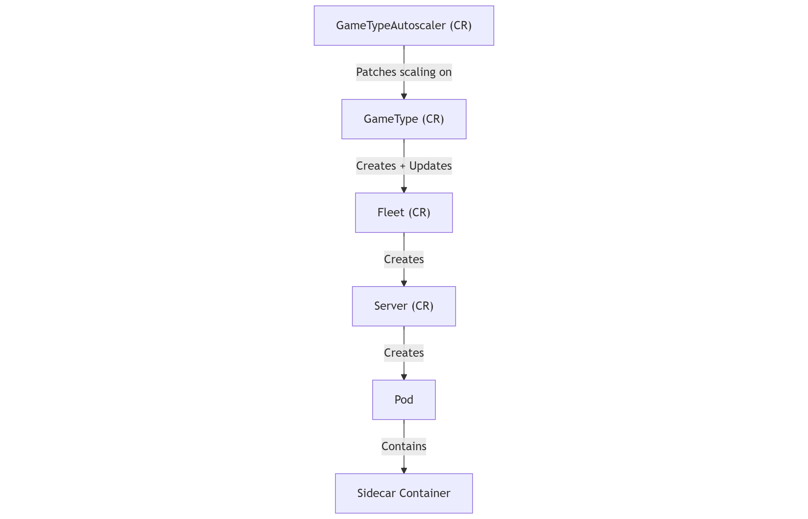

# Architecture

This page provides an overview of the general architecture of the project, explaining how the custom resources work together to manage game servers in a Kubernetes environment.

## Custom Resources

The project implements four main custom resources to manage game servers:

- [Server](server.md)
- [Fleet](fleet.md)
- [GameType](gametype.md)
- [GameAutoscaler](autoscaler.md)

### Resource Overview

- **Server**: A **Server** is a wrapper for a Kubernetes pod with added logic, typically through a [sidecar](sidecar.md).
- **Fleet**: A **Fleet** manages the creation and deletion of multiple servers, ensuring scaling and resource management for a group of servers.
- **GameType**: A **GameType** manages one or two fleets and is responsible for updating the configuration of servers, enabling gradual upgrades.
- **GameAutoscaler**: A **GameAutoscaler** triggers scaling actions based on external logic, calling a webhook implemented by the user to adjust the replica count of the **GameType**.

## Resource Relationships

The resources in this project are closely interconnected. Here's how they relate:

- **GameAutoscaler** scales a **GameType** based on external inputs (via webhook).
- **GameType** creates and updates **Fleets** based on its configuration.
- **Fleets** manage the creation and deletion of **Servers**.
- **Servers** manage individual **Pods**.

This relationship can be visualized in the following diagram:

## Server Deletion Blocking

The blocking of server deletion is a critical aspect of this system. It ensures that a server is not deleted until all conditions for safe deletion are met.

This is achieved through the use of **finalizers**. When a new **Server** object is created, the controller automatically adds a finalizer. The finalizer ensures that the server cannot be deleted until the associated sidecar reports that deletion is allowed.

The process is as follows:

1. A finalizer is added to the **Server** object upon creation.
2. The **Sidecar** (detailed in [Sidecar](sidecar.md)) monitors the server and reports when deletion is allowed.
3. Only once the sidecar confirms that deletion is allowed will the finalizer be removed, and the **Server** can be deleted.

The flow of communication between components can be seen in the following diagram:

