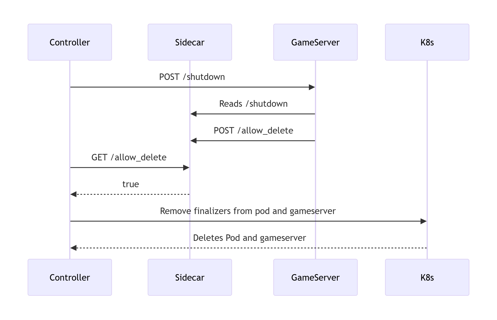

# Sidecar

The sidecar pattern is widely used in Kubernetes. It typically involves running a secondary container alongside the main application container to provide additional functionality. You can read more about the pattern [here](https://kubernetes.io/docs/concepts/workloads/pods/sidecar-containers/).

In this project, the sidecar acts as a communication bridge between the controller and the game server.

The sidecar exposes a simple REST API with a few routes that the server and controller interact with.

## Routes

The sidecar provides the following endpoints:

- `GET /allow_delete`
- `POST /allow_delete`
- `GET /shutdown`
- `POST /shutdown`
- `/health`

---

### Allow Delete

The `allow_delete` routes are used to check or set whether the server is allowed to be deleted.

- **`GET /allow_delete`** — Retrieve whether deletion is allowed.
- **`POST /allow_delete`** — Set whether deletion is allowed.

Both the GET and POST methods operate on the same internal boolean value.

#### Request Format

**JSON Example:**
```json
{
  "allowed": true
}

```
**Go Struct Example**:
```go
type DeleteRequest struct {
    Allowed bool `json:"allowed"`
}
```

The boolean value controls whether the server considers itself safe to delete.
* The controller usually issues GET requests to check the status.
* The game server typically issues POST requests to update the status.
> **Note:**
> 
> Be cautious when toggling the `allowed` state back to `false`.
> If the controller detects `allowed = true`, it may already begin the deletion process, even if you immediately set it back to `false`.

### Shutdown
The `shutdown` routes indicate whether a shutdown has been requested for the server.

* `GET /shutdown` — Retrieve whether shutdown has been requested.
* `POST /shutdown` — Set whether shutdown has been requested.

Similar to `allow_delete`, these routes operate on an internal boolean value.

#### Request Format
**JSON Example**:
```json
{
  "shutdown": true,
}
```
**Go Struct Example**:
```go
type ShutdownRequest struct {
    Shutdown bool `json:"shutdown"`
}
```
The controller sets this flag once it detects a deletion timestamp on the `Server` object.
The game server can poll this value to detect when a shutdown has been requested and gracefully handle it.

The communication workflow can be viewed here:

